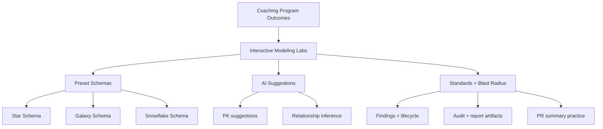

# Coaching Pivot Plan — ERD + AI Modeling Lab

Last Updated: 2026-02-27

## Strategy Graph

## Task List (Coaching Wedge)

### Track 1 — Preset Learning Models
- [x] Add Star Schema preset
- [x] Add Galaxy Schema preset
- [x] Add Snowflake Schema preset
- [x] Add lesson prompts per preset (what to improve, what to validate)

### Track 2 — AI-Assisted Learning
- [x] Add button for AI model suggestions
- [x] Suggest likely PKs by field/table naming
- [x] Infer likely many-to-one relationships by `_id` matching
- [ ] Add confidence labels and explanation text for each suggestion

### Track 3 — Demo Readiness Workflow
- [x] Demo readiness endpoint + UI check
- [x] One-click “Run Full Coaching Exercise” script
- [ ] Student report template (score + findings + coach notes)

### Track 4 — Cohort Operations
- [ ] Instructor dashboard (student attempts + score trends)
- [ ] Assignment export/import package
- [ ] Rubric scoring baseline (naming, PK/FK, standards)

## What was started immediately
- Added three new modeling presets to demo selector.
- Added AI suggestion action for PK and inferred FK relationship generation.

## Next immediate actions
1. Add per-suggestion explanation panel with confidence.
2. Add lesson instructions for each schema preset.
3. Add one-click coaching exercise runner (load preset -> validate -> impact -> report export).
